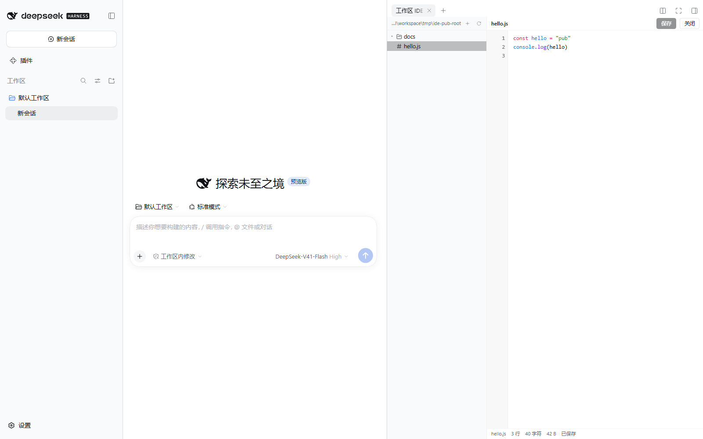
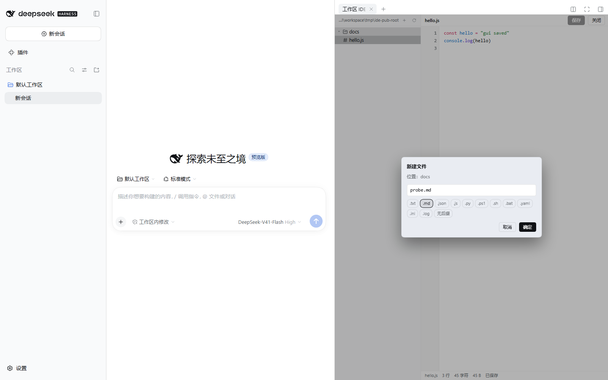
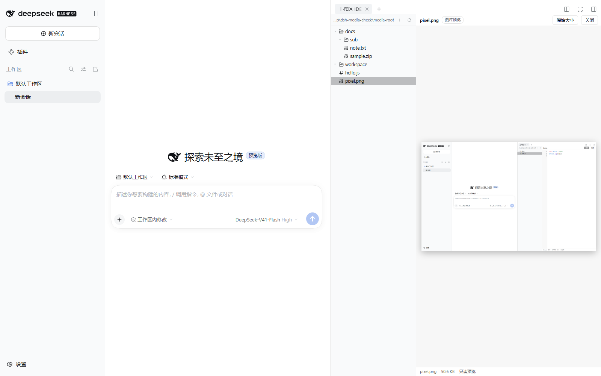
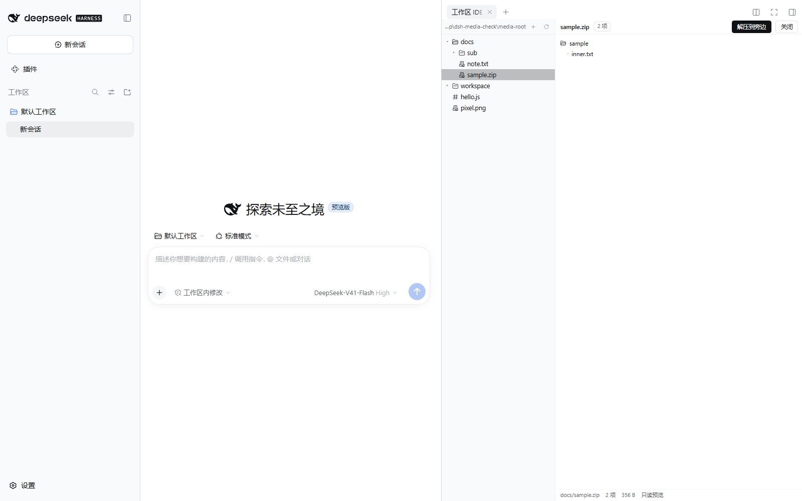

# dsh-ide-vscode

给 [DeepSeek Harness](https://github.com/deepseek-ai)（DSH）右侧栏装一个能读能写的 IDE：**左边是工作区文件树，右边是编辑器 / 图片预览 / 压缩包查看**，文件可以直接改、`Ctrl+S` 直接存。



## 它解决什么问题

DSH 自带的工作区文件面板只能看不能改（宿主的 `workspaceFiles` 服务是只读的）。想看代码、改一行配置、新建个脚本，都得切出去用别的编辑器。
这个插件把「文件树 + 编辑器」直接放进右侧栏的标签页：改完 `Ctrl+S` 就落盘，不用离开 DSH。

## 功能

### 文件树（左）

- 展开 / 折叠目录，点文件就在右侧打开
- **目录上右键**：新建文件… / 新建文件夹… / 打包成 zip… / 刷新
- **文件上右键**：重命名 / 改后缀… / 删除 / 打包成 zip…
- 树空白处右键 = 对当前选中的目录操作
- 新建文件时给一排**后缀胶囊**（`.txt .md .json .js .py .ps1 .sh .bat .yaml .ini .log 无后缀`），点一下自动补全名字，也可以手打任意后缀



### 编辑器（右）

- 行号 + 语法高亮（用宿主自带的 shiki 高亮器，按扩展名识别）
- 直接打字编辑；`Tab` 插入两个空格；`Ctrl+S` 保存（也有「保存」按钮）
- 状态栏显示 **行数 / 字符数 / 字节数 / 已保存·未保存**；有未保存修改时文件名旁带一个圆点
- 切换文件时如果当前文件有未保存的修改，会问「保存并打开 / 放弃修改 / 取消」

### 图片（点开就预览）

`.png .jpg .jpeg .gif .webp .bmp .ico .avif` 点开直接当图片显示（不是丢给你一句「不是文本文件」）：可切「原始大小 / 适应窗口」，状态栏显示文件大小与「只读预览」。图片走 `GET /api/ide-vscode/raw`，单张上限 64 MB。



### 压缩包（看内容 / 解压 / 打包）

- `.zip .tar .tar.gz .tgz .gz .7z .rar` 点开列出**包内成员**（目录缩进显示，最多列 1000 项，超出会提示总数）
- 面板上「**解压到旁边**」：解到压缩包旁边的同名目录（已存在就自动用 `名字-2`，不会覆盖）；解出来的顶层目录与压缩包里存的一致（和资源管理器 / 7-Zip 的默认行为相同）
- 文件或目录右键「**打包成 zip…**」：在它旁边生成 `<名字>.zip`；同名已存在会提示，不会默默覆盖
- 底层用系统自带的 `tar`（Windows 10+ 自带 bsdtar），所以不用装任何依赖；系统没有 `tar` 时会明确报错



### 删除

- 默认**移到回收站**，不是真删；对话框里另有「彻底删除」按钮并二次确认
- 回收站位置会写在删除后的提示里（默认 `<工作区根>/.dsh-ide-vscode/trash`，可配置，见下）

### 在哪里打开

- 右侧栏点 `+` → 起始页上的「工作区 IDE」卡片（图标是文件树）
- 会话里点到 `.js .ts .py .json .ps1 .yaml ...` 这类代码 / 配置文件时，也会直接开在这个 IDE 里
- `.md`、`.html` 仍交给 DSH 自带的文档预览，不抢

## 安装

从插件市场装（推荐）：**设置 → 插件 → 插件市场 → 搜 `dsh-ide-vscode` → 安装**。

或者命令行：

```bash
dsh plugin --profile desktop add dsh-ide-vscode
```

（`desktop` 换成你在用的 profile 名；用 `dsh web` 的话是 `--profile web`。）

**装完要重启一次 DSH。** 插件包列表只在启动时读，热加载不会带上新插件。

## 工作区根目录（配置）

树显示哪个目录，按这个顺序决定：

1. 环境变量 `DSH_IDE_ROOT`
2. 插件包目录下的 `ide-root.json`，例如 `{"root": "D:\\my\\project"}`
3. 宿主进程的当前目录（`process.cwd()`）

回收站同理：`DSH_IDE_TRASH` > `ide-root.json` 里的 `trash`（相对根目录）> 默认 `<工作区根>/.dsh-ide-vscode/trash`。

`ide-root.json` 是本地文件，既不在 git 里也不在 npm 包里（想留一份自己的根目录就写它）。

## 安全边界

- 所有路径都相对根目录解析，**越出根目录一律 403**（`..` 跳出去、绝对路径都拦）
- 只接受回环地址（`127.0.0.1` / `::1`）的请求；写操作如果带 `Origin`，还要求它与 `Host` 同源，否则 403
- `node_modules`、`.git`、`.pnpm-store` 等目录拒绝写入 / 新建 / 删除
- 名称校验：空名、`.`、`..`、Windows 非法字符、保留名（CON / PRN / AUX / …）、超过 200 字符一律拒绝
- 读单文件上限 2 MB、单张图上限 64 MB，写上限 8 MB，单目录最多列 5000 项，压缩包最多列 1000 项
- 解压 / 打包调系统自带的 `tar`，命令带 5 分钟超时；解压出来的东西只落在工作区根目录内

## 兼容性

- DSH `>= 0.1.5-rc.1`（web / desktop，用到右侧栏标签页 API）
- Node `>= 22`
- 解压 / 打包需要系统有 `tar`（Windows 10 1803+ 自带 bsdtar，Linux / macOS 自带）
- 没有第三方运行时依赖，不联网

## 已知限制

- 不是完整的 VS Code：没有 Monaco、没有 LSP 补全、没有终端 / Git / 全局搜索，编辑体验就是「行号 + 高亮 + 存盘」
- 一次只开一个文件，没有多标签
- 图片只做预览，不能裁剪 / 缩放后另存；视频、PDF、Office 文档不处理
- 压缩包只支持系统 `tar` 认识的那些格式（`.rar` 一般解不了，Windows 自带的 bsdtar 不含 rar 解码器），加密包不支持
- 编辑二进制文件不行（不认识的二进制后缀仍然不打开）
- 读写走插件自建的本地 HTTP 路由（挂在宿主 web server 上，只服务这个面板），因为宿主提供的文件服务是只读的

## 开发

```
lib/index.js          host 半边：13 条路由（root / list / read / stat / raw / archive / extract / compress / write / create / rename / delete / log）
client/client.js      客户端半边：右栏标签页 + 文件树 + 编辑器 + 图片预览 + 压缩包面板（React，复用宿主的 ui primitives）
cordis.patch.yml      把插件插进 bundle 列表
ide-root.json         本机根目录配置（gitignore，不进包）
test/host-smoke.mjs   69 项：全部路由、越界、改名、回收站、图片 / 压缩包、Origin 闸（离线，无需 DSH）
test/client-smoke.mjs 34 项：bundle 契约与面板注册（离线，jsdom + react）
test/dom-e2e.mjs      42 项：真 DOM 交互（点右键菜单、打字、Ctrl+S 落盘、图片预览、压缩包解压）
test/gui-verify.mjs   真 GUI 端到端：无头 Edge + CDP 真鼠标真键盘，对隔离的 DSH 实例跑完整流程
```

```bash
npm test        # host + client + dom，三套全部离线
```

`test/gui-verify.mjs` 需要一个带 token 的 DSH 网页地址（`dsh web` 启动时会打印），用法见文件头部注释。

## License

MIT

---

## English

`dsh-ide-vscode` puts a small IDE into the DeepSeek Harness right sidebar: a workspace file tree on the left, an editor / image preview / archive viewer on the right.

- **Create** files and folders from the context menu, with one-click extension chips; **rename** (extension included) and **delete** (to a trash folder by default, hard delete on request).
- **Edit** in place with line numbers and syntax highlighting, `Tab` for two spaces, `Ctrl+S` to save; unsaved changes are tracked and confirmed before switching files.
- **Pictures** (`.png .jpg .jpeg .gif .webp .bmp .ico .avif`) open as an image preview, fit-to-window or 1:1, never as a "not a text file" error.
- **Archives** (`.zip .tar .tar.gz .tgz .gz .7z .rar`) list their members, can be unpacked next to themselves, and any file or folder can be packed into a `.zip` from the context menu — all through the system `tar`, so there is no runtime dependency.
- Opens from the right-sidebar **+** start page ("工作区 IDE" card) and takes over code/config files (`.js`, `.ts`, `.py`, `.json`, `.ps1`, …) opened from a session; Markdown and HTML stay with DSH's own preview.
- Install from the plugin market or `dsh plugin --profile desktop add dsh-ide-vscode`, then **restart DSH** (new bundles are only read at startup).
- The host half adds 13 local routes under `/api/ide-vscode` behind a loopback + same-origin gate, because DSH's built-in `workspaceFiles` service is read-only.
- Workspace root: `DSH_IDE_ROOT` env var, else `{"root": "..."}` in `ide-root.json` next to the package, else `process.cwd()`.
- No third-party runtime dependencies, no network access. MIT licensed.
